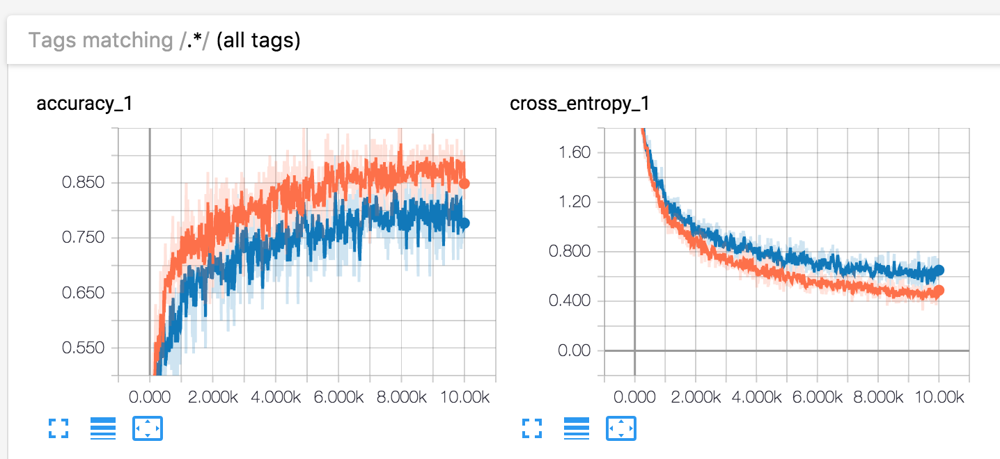
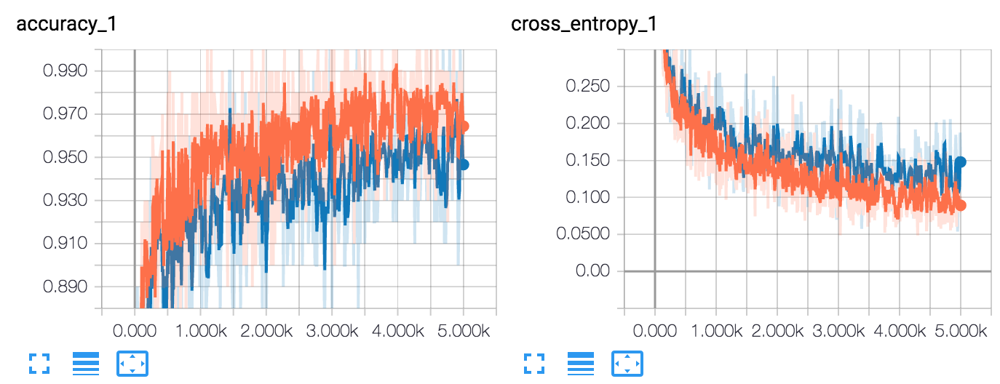

# Gesture Recognition (previously multi-robots)

Humans can today get big advantages through the usage of robots. Unmanned Aerial Vehicles (UAVs) are capable of quickly and easily maneuver in the air and can for example scan a large area and create a map of the surroundings, while Unmanned Ground Vehicles (UGVs) are strong at clearing paths and moving objects at dangerous or inaccessible locations for humans.

This project started out investing the scenario of a human pointing in a direction where a UAV should travel. Then the UAV flies in that direction and looks for a human waving their arms (a Help Gesture). Then the UAV communicate the location to a UGV which goes over to the human in need. This fairly quickly showed to be a project to big for the time span, so the project got narrowed down. The final result aimed at being able to detect humans, see in which direction a human is pointing and detect a human holding their arms up.


## Different algorithm choices

During the project’s research phase, we decided that we wanted to use state of the art machine learning algorithms that have a proven track record. We therefore began investigating the possibility of using a Convolutional Neural Network (CNN). CNNs have been gaining a lot of momentum lately and dominated competitions such as ImageNet Large Scale Visual Recognition Challenge (ILSVRC).

Initially we attempted to train our own CNN, which consisted of two convolutional layers and two pooling layers. When testing the network we got problems with overfitting. A figure of the architecture of our own CNN can be seen below. Therefore, we chose to use an existing CNN, [GoogLeNet’s Inception network](https://arxiv.org/abs/1409.4842), and only trained the final layer to suit our problem. This method was used for Direction Gesture, Help Gesture and IR.


###### Figure of our own CNN architecture.

## Gestures

Two different gestures were chosen for the network to detect. One from a UAV’s perspective where a human is pointing in one direction (pointing gesture) and the other one where a human is holding their arms up from a straight forward perspective (help gesture).

#### Direction gesture
The images are labeled with 13 labels, where label 0 represents images with no direction gesture. Labels 1-12 represents a direction angle, from 0° to 360° with steps of 30° for each label.

#### Help gesture
For this gesture two labels are used. Label 1 if the person raises both arms in the air in a waving motion and label 0 otherwise.

## Choice of data (RGB/IR)

For the different challenges, we had to gather data in different ways. All images were compressed into 256x256 resp. 64x64 pixels. For the Direction Gesture, we used 256x256, whereas the IR and Help Gesture we used 64x64. The reason to why both 256- and 64-images were created was that the 64-images would be faster to train a network with, while 256-images contained more information and would therefore more likely give a better result.

### Direction Gesture

Since our group had access to a drone equipped with an RGB-camera, we decided to use it to gather our data. We chose to gather data by hoovering the drone at a low heights ~4-10 meters and pointing the RGB-camera straight down. Then, we could place a person below the drone to perform a pointing gesture and gather our data.

Initially, we spun the drone while the person on the ground stood completely still pointing. By doing so, we got thousands of images which were easy to label (since the drones rotation speed was known). The problem we faced when doing this was that the background rotated together with the person, which was misleading for the classifier. Therefore, during the later parts of the project, we changed our method and removed the rotation from the drone. Instead, we decided to that the person on the ground would rotate. This got us a lot better training data, but took more time to label.

The environments from which we captured data was mainly outdoor environments between the A-house and B-house, meaning the images’ backgrounds were grass and asphalt.

### Help Gesture

For this challenge, we initially gathered data using the same drone. However, when we realized that we wanted to demo our progress easily live, we decided to gathering data using a laptop camera and recording data from 1-5 meters and tried to vary the angle of the laptop camera. Since we imagined the a demo to take place indoor, we gathered most of the data indoors and recorded in different parts of the B- and F-house.

### IR

All IR data gathered was through finding videos on the internet and then splitting them up into a total of 48’641 IR images. Labeling was fairly easy since it was known which images contained humans and which didn’t. Most videos also contained more than one scene, which gave more variating data to train and test with.

## Instructions for how to use the program
Using the program can be divided into two main categories: training the network and using it to classify new images. How these tasks are performed is described below.

### Training an inception network
To train an inception network the `retrain.py` script is used. First you place the training data in a folder where all images are placed in a subfolder with the same name as the label, i.e. there should be one subfolder for each class label. The script then has to generate bottleneck-files, one for each training image, that represent the output from the inception network up to the final layer which is supposed to be retrained for the specific task, e.g. direction gesture. To be noted is that a bottleneck file for an image only needs to be generated once, and can be reused.

The script output is two files. One for the output graph and one containing the labels, `output_graph.pb` and `output_labels.txt` respectively.

To run the `retrain.py` script, the following command should be entered in the terminal:

> python Inception/image_retraining/retrain.py --image_dir=./data/inceptionImages/helpGesture/

where image_dir points to the directory with the images the network should train on. It is important that the images are divided into subfolders, named after each label. If the labels are 0 and 1, the image_dir should point towards a folder with subfolders named 0 and 1, which only contain their respective images.

### Parameters and how to change them
The `retrain.py` script supports a bunch of different parameters, both to change where files are loaded from and where they are saved to but also parameters that changes the result of the final model. The ones that effects the final model are described here. The commands are appended to the basic command under “Training an inception network”.

`--how_many_training_steps` - how many steps the training is run for. Default value is 4000.
`--learning_rate` - learning rate. Default 0.01.
`--train_batch_size` - how large is batch is. Default 100.
`--flip_left_right` - determines if half of training images should be randomly flipped horizontally.
`--random_crop` - determines if images should be randomly cropped. Entered as a percentage, 0-1.
`--random_scale` - determines if images should be randomly scaled up with the percentage entered, 0-1.
`--random_brightness` - determines if images should be brightened/darkened, entered as a percentage, 0-1.
`--architecture` - determines which architecture should be used. Default is the inception V3, but could be switched for MobileNet which is a lot faster and creates model of lower file size but has slightly lower accuracy.

The parameters that distorts the images has not been used during the project, since they can’t use the bottlenecks to speed up the training. When adding distortions, each image becomes unique and the bottlenecks can no longer be used to save time. When adding these parameters, and training on ~10 000 images for 100 epochs on a cpu the estimated training time was almost 20 days. Training on a gpu might make the training more easily handled, time-wise.

### run_inception_classifier.py

To classify a set of images the argument below simply has to be run in the terminal.

> python run_inception_classifier.py --model_name=model --path_images=path_to_image_folder --path_output=path_to_classified_images

The argument `model` specifies with model is to be used, i.e. `directionModel`, `irModel` or `helpGestureModel`. The argument `path_to_image_folder` is simply the path to the folder containing the images to be classified. This folder will get a temporary folder when running the script, in this folder the preprocessed images are placed. The `path_to_classified_images` argument specifies the folder where the user wants the classified images to be stored. If this argument is left out this folder be be inside the folder specified by ´path_to_image_folder`.

### Webcam live demo - classifyWebcamInception.py

This script lies under `inception/` and can be used to test any inception network live. Frames taken from the webcam are preprocessed and classified by the specified model and the output is displayed as an integer in the top left corner of the webcam feed on the computer.

To run the script two arguments are required as shown in the example below.

> python inception/classifyWebcamInception.py
> --graph=inception/models/helpModel/output_graph.pb
> --labels=inception/models/helpModel/output_labels.txt


### Gathering and processing data

Data were gathered in different ways based on to which network it was meant to be used. For the help gesture, the laptop RGB-camera of a Mac Book Pro 2017 was used to record people from ground level. For the direction gesture, a drone with a RGB-camera was placed 4-10 meters up in the air. For the human detection, IR videos was gathered from the web. These were then processed, which will be described further down.

#### Loading and saving data

There exist one `*_data`-file for each of the three models: ir, direction_gesture and help_gesture. These three files are used to split the data into `.npz`-files. Once these npz-files exist, these data-files load the npz-files to create a Dataset-object which stores training data and labels.

#### Preprocessing

One propressing script for each model was used. These scripts include `direction_gesture_preprocess.py`, `help_gesture_preprocess.py` and `IR_preprocess.py`. Within the scripts a video path is set where each frame in the video later is automatically resized to a square and reshaped to 64 by 64 pixels (also 256 by 256 for direction gesture). All preprocessed images are placed in a specified folder.

##### IR_manual_preprocess.py

Also one script was written for fast manual labelling of IR images where the IR image is cropped into several images and labeled manually by the user. The cropped image is shown for the user and is then labeled by pressing 1 or 0 on the keyboard.

##### Recording Help Gesture data

In `classifyWebcamInception.py`, simply uncomment the row..

> resizedImage.save(...)

.. and set a file name. The ending of this file name has to be 0 or 1, where a 0 indicates no help and 1 indicates need help. Then, when running `classifyWebcamInception.py`, the program will not only attempt to classify the webcam, but also save all images which can later be used to train the model further.

### Visualize in Tensorboard
To visualize the training procedure the following command can be run:

```tensorboard --logdir=/tmp/retrain_logs```

where `logdir` should point towards the directory containing the log files. When retraining the final layer of Inception, these are put by default in the /tmp folder. When using the homebrewed model they are put into the logs folder in the repository.

When retraining the final layer of the inception model, multiple scalars are tracked. How accuracy and cross entropy changes is shown below.



###### Tensorboard when retraining inception for directionGesture, ~100 epochs. Orange = training, blue = validation. 



###### Tensorboard when retraining inception for Help Gesture, ~100 epochs. Orange = training, blue = validation.


### Results of train and test data

#### Direction Gesture
The direction gesture was trained using 9643 images, from 9 different scenes.

The accuracy of our model can be split into three categories:

Accuracy on new images from known scene: 87%
Accuracy on images from unknown scene: 47%
Accuracy when counting “close” predictions: 75% (i.e. being one “hour” off)

#### IR Gesture
Accuracy on new images from known scene: 99.9%
Accuracy on new images from unknown scene: 65%

#### Help Gesture

Accuracy on new images from known scene: 96%
Accuracy on images from unknown scene: 73%


### Repository structure


`data/images/directionGesture/` contains labeled images for the direction model. Where the subfolders, `droneRotate` contains the scenes where the person is standing still and the drone is rotated. `images64` and `images256` contains data where the drone is standing still and the person is rotating, images with size 64*64 and 256*256 respectively.    
`data/images/helpGesture/` contains data for the helpGesture model, where the subfolders `helpGestureTest` contains test data and `helpGestureTrain` contains labeled data for training

`data/images/IR/` contains labeled data for the IR model and `data/images/incorrectClassifications/` holds incorrect classified images.

The `misc` folder contains smaller scripts that has been used throughout the project. The `models` folder contains the models for  the “homebrewed” networks.  

The `inception` folder contains pretrained models and code for retraining the inception model.
